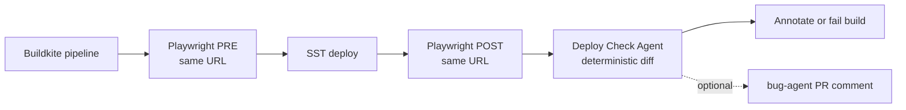

## Why this design

Your regression was invisible in the PR diff: a dependency swap dropped an **extra field on an API call**, so the UI stopped rendering a block. A **Deploy Check Agent** in CI closes that gap with very little "analysis":

1. **Paired screenshots** (PRE vs POST) per flow — quick visual regression signal.
2. **Structured API traffic** — for each matched request (same path + method), diff JSON body **keys** (and optionally status / small response excerpt). Missing `tenantId` shows up as a one-line diff, no LLM.

The **bug-agent** codebase stays focused on static diff + LLM review. This new agent is intentionally tiny and lives **where the deploy already happens** (Buildkite plugin or pipeline repo), so AWS/SST credentials never leave that world.

## Where code lives

| Piece | Repo |
| --- | --- |
| Playwright + capture reporter | Micro-frontend or shared **CI/CD** repo |
| `deploy-check` CLI (diff only) | Same as Buildkite **plugin** bundle, or a small internal npm package |
| Optional LLM / Bitbucket threading | **bug-agent** — only if you later want one combined comment |

**Option A — Inline pipeline (fastest).** Steps in `pipeline.yml`: capture-pre → deploy → capture-post → `deploy-check diff`.

**Option B — Buildkite plugin.** One command wraps artifact download + `deploy-check` + `buildkite-agent annotate`. Use when two or more repos need the same glue.

Ship **A** first; extract **B** when you copy-paste the same block twice.

## Scope of the demo

One micro-frontend, SST, **same public URL** before and after deploy:

1. **PRE** — Playwright records `pre.json` + screenshots while the previous build is still live.
2. **Deploy** — existing SST step.
3. **POST** — same suite, `post.json` + screenshots after wait/health check.
4. **Deploy Check Agent** — `diff pre.json post.json` → markdown + non-zero exit on regression.

**Config** for v1 can live entirely in the Playwright repo (which URLs to hit, which selectors to assert, auth bypass). Optional `deploy-check.yaml` in the plugin repo only if you want shared thresholds (e.g. ignore query-string noise).

Out of scope for v1: LLM narration, pixel-perfect image diff services, multi-browser, long-term baseline storage (PRE/POST pair is enough).

## High-level flow



## What the Deploy Check Agent actually does (v1)

**Inputs:** `pre.json` and `post.json` (same schema version), plus screenshot files on disk referenced by relative paths inside the JSON.

**Diff logic (all deterministic, small code):**

- For each `flowId` present in both runs: compare `mustExist` selector results (boolean per selector).
- Align HTTP entries by stable key: `(method, normalized path pattern or exact path)` — configurable ignore list for auth, analytics, WebSocket.
- For aligned POST/PUT/PATCH: parse JSON if possible; diff **top-level keys** (and one level deep if you need it). Flag keys present in PRE body but absent in POST.
- Compare HTTP status per aligned call; flag 2xx → 4xx/5xx regressions.
- Screenshots: optional file hash or perceptual hash; on mismatch, report "visual drift" and link both paths (Buildkite artifact viewer makes side-by-side easy).

**Output:** Markdown suitable for `buildkite-agent annotate`; exit `1` if any severity-`error` finding (configurable).

**No LLM** in v1 — the whole point is that the analysis surface is small.

## Files to add / change (by repository)

### A. Plugin / CI repo — `deploy-check` package

- `packages/deploy-check/src/cli.ts` — `diff` subcommand, reads two files, prints markdown, sets exit code.
- `packages/deploy-check/src/diff/*.ts` — pure functions: `diffFlows`, `diffHttp`, `diffScreenshots`.
- `packages/deploy-check/src/schema.ts` — Zod (or similar) for `CaptureBundle` v1.
- Optional: `hooks/post-command` for Buildkite plugin that downloads `$BUILDKITE_*` artifacts and invokes the CLI.

### B. Micro-frontend (or CI) repo — capture only

- `tests/runtime/**/*.spec.ts` — navigate, assert, trigger actions that fire API calls.
- Custom Playwright reporter → writes `pre.json` / `post.json` + screenshots directory.
- Buildkite: env `CAPTURE_PHASE=pre|post` so one codebase emits the correct filename.

### C. bug-agent repo — optional phase

- Only if you want **one** Bitbucket comment: add an HTTP endpoint or extend `/analyze` to accept the two bundles and append a `## Deploy runtime` section. Otherwise skip entirely — Buildkite annotation is enough for many teams.

## CaptureBundle shape (illustrative)

```json
{
  "schemaVersion": 1,
  "phase": "pre",
  "capturedAt": "2026-04-20T12:00:00Z",
  "targetUrl": "https://staging.example.com",
  "flows": [
    {
      "flowId": "settings-save",
      "selectors": { "[data-testid=save]": true, "[data-testid=banner]": true },
      "screenshot": "screens/settings-save.png",
      "http": [
        { "method": "POST", "url": "https://staging.example.com/api/settings", "status": 200, "bodyKeys": ["tenantId", "theme"] }
      ]
    }
  ]
}
```

Redact tokens in `url` if needed before write; keep `bodyKeys` not raw secrets.

## Demo acceptance criteria

- **Green path:** PRE and POST captures are near-identical → `deploy-check` exits 0, annotation says no regressions.
- **Red path:** Drop `tenantId` from the client POST → diff reports missing key; step fails (or warns, per config).
- **UI path:** Remove a conditional block → selector map flips `false` or screenshot hash drifts; reported in markdown.

## Non-goals (v1)

- LLM explanations, bug-agent scheduling, or merging with static code review (optional later).
- Full HAR replay, perf budgets, accessibility audits.
- Public Buildkite plugin marketplace — private repo or monorepo path is fine.
- Storing months of baselines — PRE/POST per deploy is sufficient for the bug class you described.
